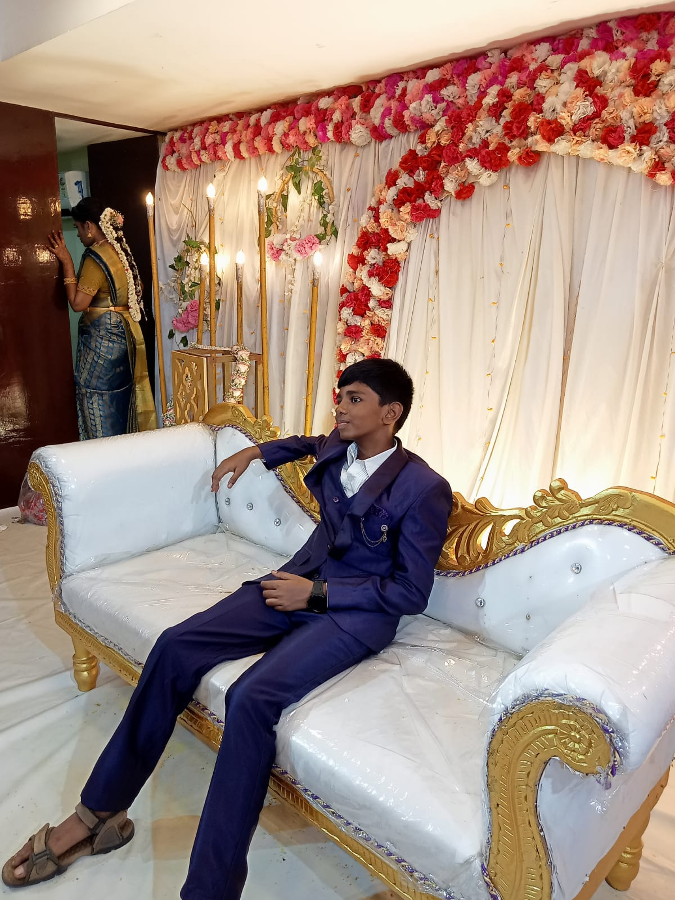

<h1 STYLE="text-align:center;font-size:25px;">BALAN MUTTON STALL</h1>

<i>“Redefining Excellence in Every Order
Commitment to Quality, Delivered Promptly 
Your Satisfaction, Our Mission”</i> 

  <!-- Navigation Links -->
  

    <a style="margin-right: 20px; font-size:18px;" href="file:///C:/Users/hp/Desktop/home.html#">Home</a>
    <a style="margin-right: 20px; font-size:18px;" href="file:///C:/Users/hp/Desktop/Review.html">Review</a>
    <a style="margin-right: 20px; font-size:18px;" href="https://www.google.com/maps/place/Balan+mutton+stall/@9.9323774,78.1287662,17z/data=!3m1!4b1!4m6!3m5!1s0x3b00c5c7225f8b59:0x7c806a7217ac8178!8m2!3d9.9323774!4d78.1287662!16s%2Fg%2F11rpzg2yvf?entry=ttu&g_ep=EgoyMDI1MDYyOS4wIKXMDSoASAFQAw%3D%3D">Location</a>
    <a style="margin-right: 20px; font-size:18px;" href="file:///C:/Users/hp/Desktop/Contact%20Us.html">Contact Us</a>
	
  

  

  

  <!-- Goat Section with light background -->
  

    <h1 style="font-size:20px;text-align:center;">A Farm Is Not Complete Without A Goat</h1>
    

      
      
      
    

    <h1 style="text-align:center;font-size:20px">Advantages Of Goat Meat</h1>
    <ul style="line-height: 1.5;font-size:15px; max-width: 800px; margin: auto;">
      <li>Low in Fat: Contains less total fat and saturated fat compared to beef, pork, and lamb.</li>
      <li>Low in Cholesterol: A heart-friendly red meat option.</li>
      <li>Rich in Protein: Complete protein source with all essential amino acids.</li>
      <li>Iron-Rich: Excellent source of heme iron.</li>
      <li>High in Potassium: Helps in regulating blood pressure and electrolyte balance.</li>
      <li>Low in Sodium: Good for low-sodium diets.</li>
      <li>Contains Vitamin B12 and B6: Supports nervous system and metabolism.</li>
      <li>Less Risk of Hormones: Typically free-range, pasture-raised goats.</li>
    </ul>
    
See More Advantages:

    
<a style="font-size:20px;" href="https://www.healthline.com/nutrition/goat-meat-benefits">Advantages of Goat Meat</a>

  

  <!-- Team Section -->
  

    <h2 style="font-size:30px;">Meet Our Team</h2>
    

      <!-- Founder -->
      

        
        <h3 style="font-size:20px; margin-top: 10px;">Mr. Balan</h3>
        
Founder

      

      <!-- Co-Founder -->
      

        
        <h3 style="font-size:20px; margin-top: 10px;">Mr. Manikandan</h3>
        
Co-Founder

      

    

  

  <!-- Customer Review Section -->
  

  <h2 style="font-size:30px;">Customer Reviews</h2>
  

    
    <!-- Review 1 -->
    

      
      
"Best mutton in town! Fresh, tender and hygienically packed."

      
– Hari pranav BM.

    

    <!-- Review 2 -->
    

      
      
"Very quick delivery and excellent packaging. Loved the quality!"

      
– Hansika BM.

    

    <!-- Review 3 -->
    

      
      
"Affordable and tasty. Great service and quality meat."

      
– Neela M.

    

  

  <!-- Contact Us Section -->
  

    <h2 style="font-size:30px;">Contact Us</h2>
    

      

        <h3 style="font-size:20px; margin-top: 10px;">Mr. Manikandan</h3>
        
Owner

        
 <a href="tel:+919876543210" style="text-decoration:none;color:#000;">+91 98765 43210</a>

        
 <a href="mailto:manikandanb232@gmail.com" style="text-decoration:none;color:#000;">manikandanb232@gmail.com</a>

        
 <a href="https://wa.me/919876543210" target="_blank" style="text-decoration:none;color:#000;">WhatsApp me</a>

      

    

  

<i>“Trust Us, Every Time”</i>

